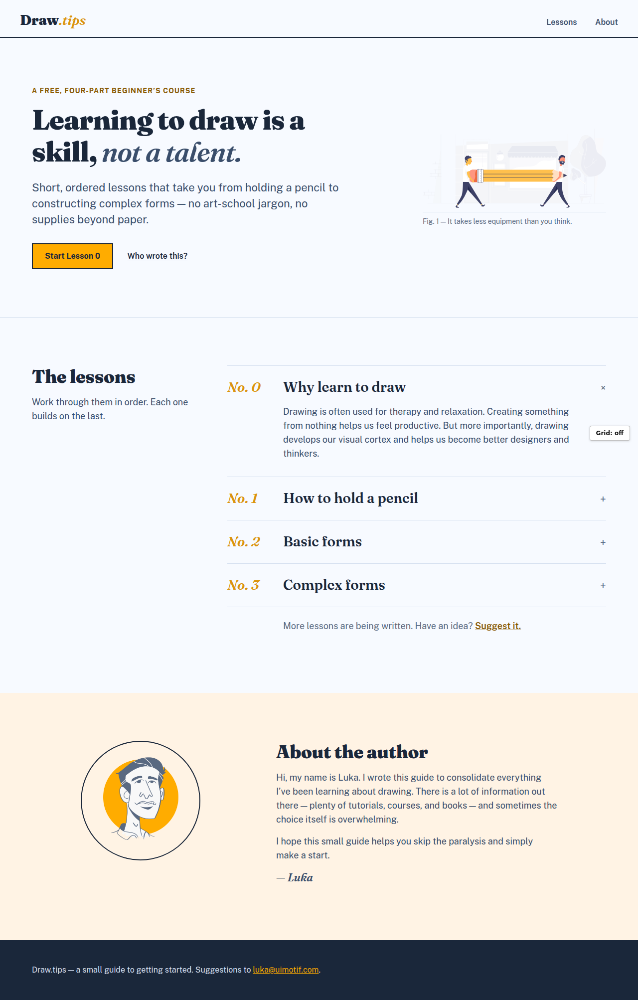
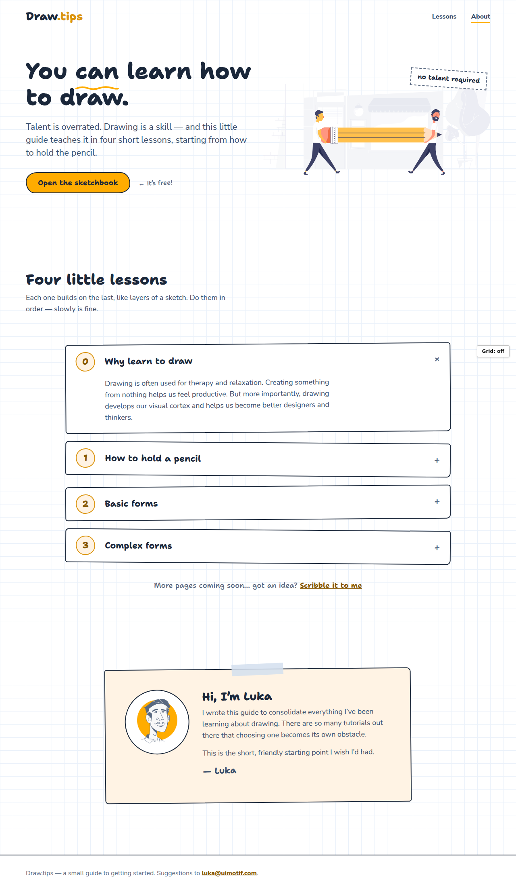
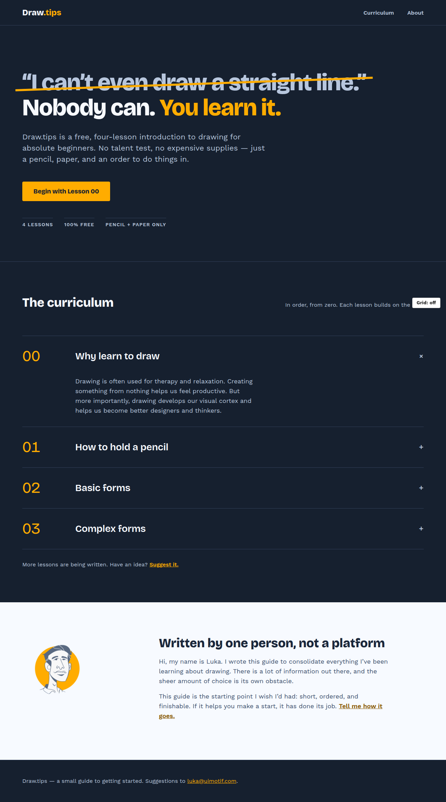

# draw.tips — design research & redesign options

Research → theory → three concrete redesign options, all sharing one system
(type scale, palette, 8px baseline, 12-column grid) but with three distinct personalities.

## Contents

1. **[01-inspiration.md](01-inspiration.md)** — 18 reference landing pages from One Page Love
   (course pages, hand-drawn/illustration-forward, playful one-pagers), with the recurring
   patterns the best ones share. Images in [`inspiration/`](inspiration/).
2. **[02-avoiding-the-claude-look.md](02-avoiding-the-claude-look.md)** — the telltale signs of
   AI-generated design, a 20-point avoidance checklist, and an audit of the current draw.tips
   design against it.
3. **[03-design-theory.md](03-design-theory.md)** — typography (modular scale), color theory
   (the slate/amber pair is near-perfectly complementary), and rhythm/grid — each ending in
   concrete numbers used by all three options.

## The shared system

- **Type scale**: 1.25 major third, base 18px — 56/44/36/28/22/18/16/14, every line-height ÷ 4.
- **Palette**: ramps from the existing slate `#596981` + amber `#FFAC00` (near-complementary,
  OKLCH hues 258°/74°). Ink `#1A273A` for text, amber only for actions, `#885800` when amber
  must be text. All pairs WCAG-AA verified.
- **Grid**: 12 columns / 24px gutters / 1200px max; 8px spacing scale; constant 96px section rhythm.
- **Fonts are self-hosted** in [`options/fonts/`](options/fonts/) so the mockups render offline.

## The three options

Open each HTML file in a browser. Press **`g`** (or the button, bottom-right) to cycle the
grid overlay: off → 12 columns → 12 columns + 8px baseline.

### Option A — "The Atelier" · [options/option-a-atelier.html](options/option-a-atelier.html)
Editorial, print-workbook feel. **Fraunces** (display serif) + **Public Sans**. Left-aligned
asymmetric hero (7/5), lessons as a numbered *syllabus* with hairline rules (no cards, no
shadows), figure-caption under the illustration, warm amber-tinted about panel, ink footer.
The most "grown-up" direction — quiet confidence, feels like a beautifully typeset book.

### Option B — "The Sketchbook" · [options/option-b-sketchbook.html](options/option-b-sketchbook.html)
Craft-material metaphors: 32px graph-paper ground, **Shantell Sans** + **Nunito Sans**,
hand-drawn squiggle underline, wobbly hand-cut button radius, dashed sticker ("no talent
required"), gently rotated lesson cards with ink borders (no shadows), taped-on note card for
the about section. The most playful direction — the page itself feels drawn.

### Option C — "The Night Class" · [options/option-c-nightclass.html](options/option-c-nightclass.html)
Two-color discipline (Database School pattern): flat deep-ink ground `#16202F` — no glow, no
gradients — **Bricolage Grotesque** + **Work Sans**, fear-disarming headline with an amber
strike-through ("I can't even draw a straight line." *Nobody can. You learn it.*), oversized
00–03 curriculum rows, one amber CTA, light break section for the author. The boldest direction —
poster energy, strongest differentiation.

### How each option dodges the checklist

All three: no purple, no gradients, no pill badge, no emoji icons, no 3-card feature grid, no
glassmorphism, no accent side-borders, no fake stats, real hierarchy (weight + case + color, 1.25
scale), AA-verified contrast, one elevation strategy each (A: rules, B: ink borders, C: hairlines),
left-aligned heroes, copy in Luka's voice, and section rhythm on the 8px grid.

Grid-overlay screenshots: [option-a-grid.png](screenshots/option-a-grid.png) ·
[option-b-grid.png](screenshots/option-b-grid.png) ·
[option-c-grid.png](screenshots/option-c-grid.png)
